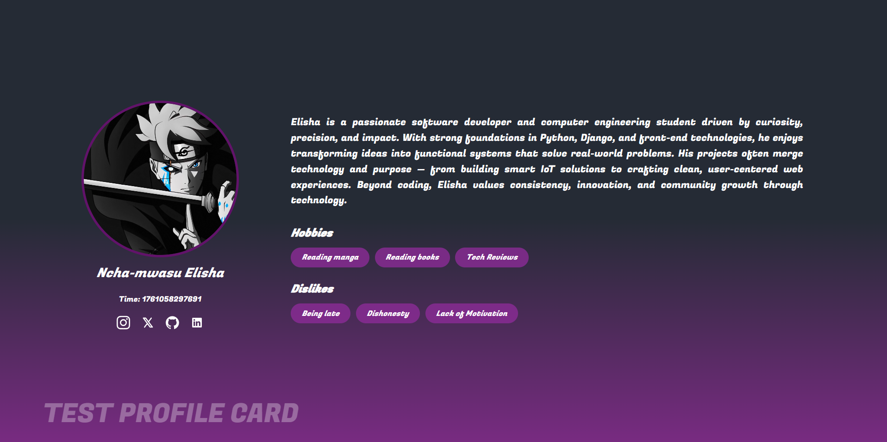

# 🌟 Profile Card - Ncha-mwasu Elisha



> A visually appealing **Profile Card** built with **HTML5** and **CSS3**, showcasing essential information, social links, and interests in a clean and modern layout.  

This project demonstrates how to combine minimal design with expressive typography and smooth gradients to create an elegant personal profile interface.

---

## 🚀 Features

- 🎨 Sleek and responsive layout  
- 🧑‍💻 Developer-themed profile content  
- 🌈 Gradient background with vibrant colors  
- 💬 Hobbies and dislikes sections styled as tags  
- 🔗 Social media icons using Font Awesome  
- 📱 Ready for further enhancements (responsive version coming soon!)

---

## 🧰 Technologies Used

| Technology | Description |
|-------------|-------------|
| **HTML5** | Structure of the page |
| **CSS3** | Styling and gradient design |
| **Google Fonts** | Typography for modern look |
| **Font Awesome** | Icon set for social media links |

---

## 📂 Project Structure

```bash
profile-card/
│
├── index.html        # Main HTML file
├── style.css         # CSS styling
├── preview.png       # Screenshot of the design
└── README.md         # Project documentation
